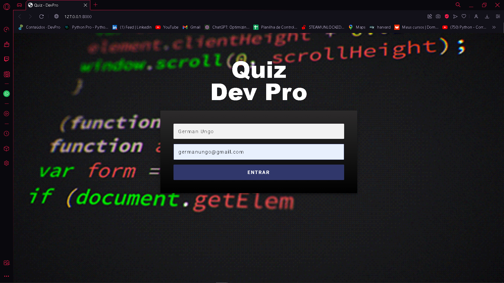
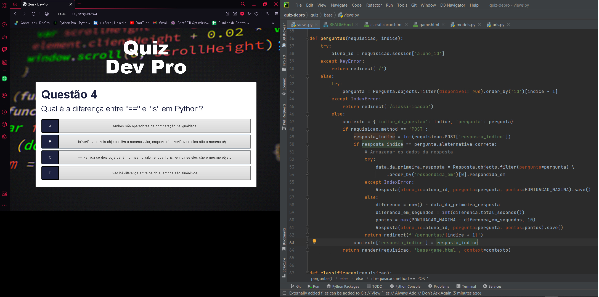

# 
Quiz DevPro

---

## Sobre o projeto

**O Quiz DevPro** é um quiz simples feito em Python e Django. As perguntas para o quiz não vêm no pacote, mas podem ser adicionadas pelo próprio administrador do framework no item "Questions".

---

## Tecnologias utilizadas

Este projeto foi desenvolvido utilizando as seguintes tecnologias:

- Python
- Django
- SQLite

---

## Como contribuir

1. Crie um fork deste repositório
2. Faça uma branch com a sua feature: `git checkout -b minha-feature`
3. Envie suas alterações: `git commit -m 'feat: Minha nova feature'`
4. Faça um push para a sua branch: `git push origin minha-feature`